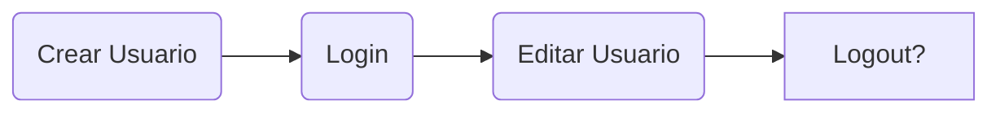
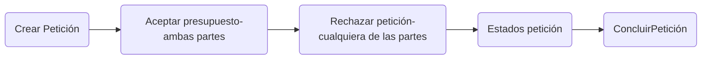
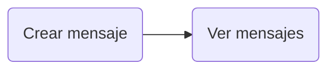
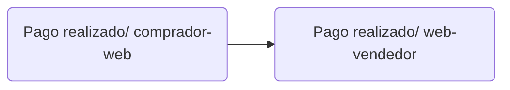
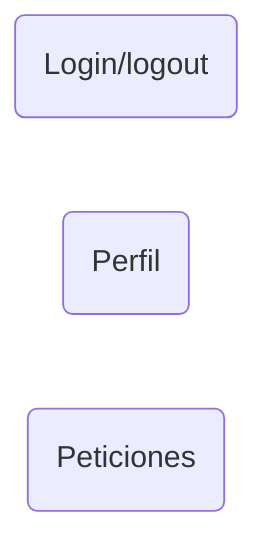

# UFAB
Project Module 3: Plataforma de venta de servicios de fabricación digital entre usuarios

## Funcionamiento

Los **usuarios** tienen o no impresoras 3D, Fresadoras, corte láser, etc. Cualquier usuario puede hacer una petición a cualquier otro usuario de que le fabriquen una pieza subiendo el archivo al crear una **petición de fabricación** . Esa petición se puede rechazar o contestar con una oferta de precio por la fabricación y un tiempo estimado. Si la oferta es aceptada por el que en primer lugar creó la petición la petición se crea. 

Esa petición tendrá estados como fabricando..., terminado..., en camino.... Al aceptarse la petición se crea un tablon de conversación.

La forma de encontrar a otros usuarios en proximidad en la localización de conveniencia escon un mapa de Google.

Los usuarios tendras valoraciones de otros usuarios. 

## Endpoints

Auth Endpoint:

Peticiones Endpoint:

Mensajes Endpoint:

Pagos Endpoint:

## Menú

## Páginas principales ( También son componentes)

Vistas Dentro de **Peticiones** :
**Peticiones pendientes**, **peticiones finalizadas**, **detalles de petición** y **peticiones rechazadas**.

Vistas Dentro de **Perfil propio** :
**Editar perfil** y **Crear perfil**.

Vistas **Perfil de otros usuarios** :
**Información de perfil**.

 **NavBar** 

## Subcomponentes 

**Perfil**
Fichas de datos de usuario, máquinas que tiene.

**Peticiones**
Tarejeta de petición 

## Props

**Perfil**
nombre de usuario
id usuario
número de cuenta
imagenUrl
Volumen piezas/ area de fresado
rating
numero de peticiones concluidas
numero de peticiones canceladas
lat.lng

**peticiones**
precio oferta
id usuario sender
nombre usuario sender
id usuario receiver
nombre usuario receiver
id mensaje
mensaje

## Modelos

**user**

id

nombre

apellidos

password

email

Maquinas

materiales

colores

location

rating

reviews (optional)

**peticiones**

id

sender id

receiver id

archivo

Aceptado sender

aeptado receiver

presupuesto

estados (una vez aceptados) 

id mensajes

**mensajes**

sender id

receiver id

peticion id

mensaje

| **HTTP Method** |  **URI path**           | **Description** |
| ------------- | ------- | ------------- |
| GET | / | All user with marker on json format for googla maps|
| GET | /user/:id | See a user profile |
| POST | /user/create| Create a User|
| PUT | /user/:id | Update owm user profile|
| GET | /jobs/:id | All your jobs|
|POST | /jobs/create |   To create a job request |
|POST|  /message/create  |  To create a message in the job request |
| GET  |  /message/:id  | To see all the messages with the id of the job request  |
